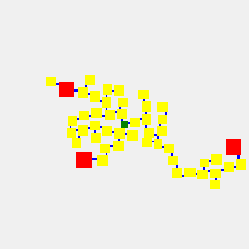

# DungeonFlow
2d axis-aligned room/hall dungeon graph generator with customizable generation steps.

# Configs
Room/Hall configs are the building blocks of each dungeon. They define the shape and collision of each piece.
* **RoomConfig**
  * `GetWidth` - The width of the room
  * `GetHeight` - The height of the room
  * `GetHall` - ID of a **HallConfig** that connects to this Room
  * `GetLinkPosition` - Gets a local link starting position
  * `Collision` - An optional `CollisionMap` used for granular collision
* **HallConfig**
  * `GetWidth` - The width of the hall when directed up
  * `GetHeight` - The height of the hall when directed up

# Steps
`IGenerationStep` is a specific alteration to the dungeon graph.

Pre-built steps are:
* **StartStep** - Adds 1 node to the center of the graph
* **RoomStep** - Adds 1 node to all nodes returned in its query
* **GoalStep** - Adds a random path of nodes ending with a goal node, starting at the first node of its query
* **DeadEndStep** - Adds varialbe length dead ends to nodes returned in its query

# Sample
```csharp
// define rooms & halls
RoomConfig[] rooms = [
	new(r => r.Next(16, 16), r => r.Next(14, 16), r => 0, GetRandomHallPosition, null),
	new(r => r.Next(18, 24), r => r.Next(18, 24), r => 0, GetRandomHallPosition, null),
	new(r => 32, r => 32, r => 1, GetRandomHallPosition, null),
];
HallConfig[] halls = [
	new(r => 4, r => r.Next(4, 6)),
	new(r => 6, r => r.Next(8, 12)),
];

// define steps
IGenerationStep[] steps = [
	new StartStep([0]),
	new GoalStep(14, [2], [1], NodeQuery.First),
	new GoalStep(14, [2], [1], NodeQuery.First),
	new GoalStep(6, [2], [1], new NodeQuery(QueryDirection.Forward, 2, 4, 1)),
	new DeadEndStep(1, 2, 13, 50, [1], new NodeQuery(QueryDirection.Forward, 1, 13, int.MaxValue))
];

// create reusable generator & config
var config = new DungeonConfig(i => rooms[i], i => halls[i]);
var random = Random.Shared;
var generator = new DungeonGenerator(config, random);

// run generation with retries
bool success = false;
int tries = 0;
while (!success && tries++ < 100)
{
	generator.Clear();
	foreach (var step in steps)
	{
		success = step.Run(generator);
		if (!success)
			break;
	}
}
```

# Renderer
A simple renderer project is included



# Installation

Install via NuGet:

### .NET CLI
```
dotnet add package DungeonFlow
````

### Package Reference
```xml
<ItemGroup>
  <PackageReference Include="DungeonFlow" Version="*" />
</ItemGroup>
```